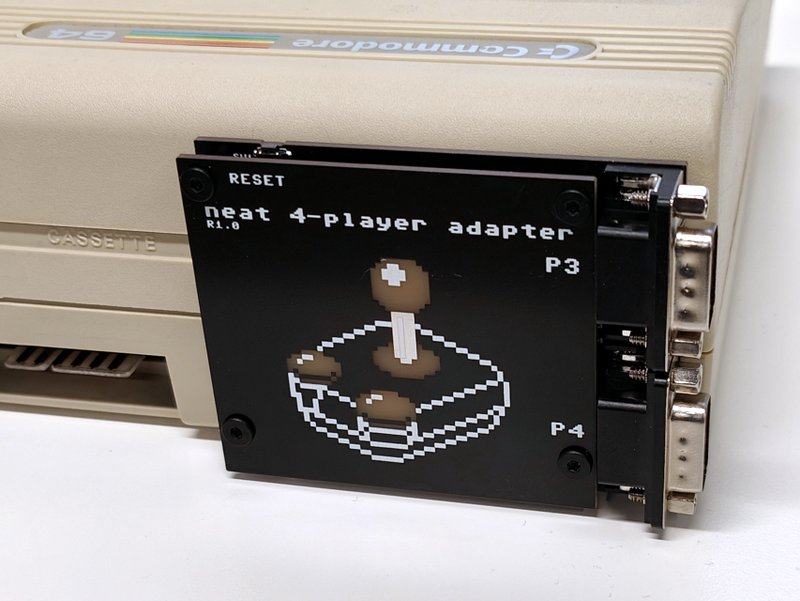

# neat 4-player adapter
4-player adapter for Commodore 64 based on the [Protovision design](https://www.protovision.games/hardw/build4player.php?language=en#buildit).

Schematic and gerbers coming soon.

Added features:
- ESD protection
- 5V output for active joysticks like optical switches, auto-fire, converters etc.
- Standard connector distance for support of joystick switchers, NES/SNES converters etc.
- Cover made of PCB. No 3D printed parts.
- Reset switch
- Compact vertical design

    

[Interactive HTML BOM](https://htmlpreview.github.io/?https://github.com/1c3d1v3r/neat_4-player_adapter/blob/main/BOM/neat%204-player%20adapter%20INTERACTIVE%20BOM.html) for soldering.\
Bill of materilas:
| Definition                                         | Manufacturer                    | Manufacturer PN   | Case/Package | Quantity | Designator | Link                                                                                         |
|----------------------------------------------------|---------------------------------|-------------------|--------------|----------|------------|----------------------------------------------------------------------------------------------|
| CAP CER 100nF 50V X7R 0805                         | Yageo                           | CC0805KRX7R9BB104 | 0805         | 1        | C1         | [Digikey](https://www.digikey.com/en/products/detail/yageo/CC0805KRX7R9BB104/302874)                   |
| RES ARRAY 10K X4 ISOLATED 1206                     | Yageo                           | YC164-JR-1310KL   | 1206         | 2        | RN1, RN2   | [Digikey](https://www.digikey.com/en/products/detail/yageo/YC164-JR-1310KL/17023153)                   |
| SWITCH TACTILE SPST-NO 160GF SMD RA                | Panasonic Electronic Components | EVQ-PUA02K        | 4-SMD        | 1        | SW1        | [Digikey](https://www.digikey.com/en/products/detail/panasonic-electronic-components/EVQ-PUJ02K/286338)|
| TVS DIODE 6CH UNIDIR. 6.1V 8-SOIC                  | STMicroelectronics              | ESDA6V1U1RL       | 8-SOIC       | 2        | D1, D2     | [Digikey](https://www.digikey.com/en/products/detail/stmicroelectronics/ESDA6V1U1RL/686390)            |
| IC MULTIPLEXER 4 X 2:1 16-SOIC                     | Texas Instruments               | SN74LS257BDR      | 16-SOIC      | 1        | U1         | [Digikey](https://www.digikey.com/en/products/detail/texas-instruments/SN74LS257BDR/1590487)           |
| CONN D-SUB MALE PLUG 9POS R/A TH                   | Assmann WSW Components          | A-DS 09 A/KG-T2S  | 9-TH         | 2        | P3, P4     | [Digikey](https://www.digikey.com/en/products/detail/assmann-wsw-components/A-DS-09-A-KG-T2S/1241804)  |
| 805 Series 2*12 Pin Card Edge Connector            | -                               | -                 | 24-TH        | 1        | J1         | [Aliexpress](https://www.aliexpress.com/item/1005003188120736.html)                                    |
| Aluminum column post M3*6mm                        | -                               | -                 | -            | 4        | -          | [Aliexpress](https://www.aliexpress.com/item/32832544494.html)                                         |
| Black Stainless Steel Flat Allen Cap Screw M3*4mm  | -                               | -                 | -            | 6        | -          | [Aliexpress](https://www.aliexpress.com/item/1005003640441632.html)                                    |
| Black Stainless Steel Flat Allen Cap Screw M3*12mm | -                               | -                 | -            | 2        | -          | [Aliexpress]( https://www.aliexpress.com/item/1005003640441632.html)                                   |
| neat 4-player adapter PCB                          | -                               | -                 | -            | 1        | -          | [JLCpcb](https://jlcpcb.com/)                                                                          |
| cover PCB                                          | -                               | -                 | -            | 1        | -          | [JLCpcb](https://jlcpcb.com/)                                                                          |

### Licence

neat 4-player adapter by <a rel="cc:attributionURL dct:creator" property="cc:attributionName" href="https://github.com/1c3d1v3r/">Pasi Lassila</a> is licensed under <a href="http://creativecommons.org/licenses/by-sa/4.0/?ref=chooser-v1" target="_blank" rel="license noopener noreferrer" style="display:inline-block;">CC BY-SA 4.0</a>

